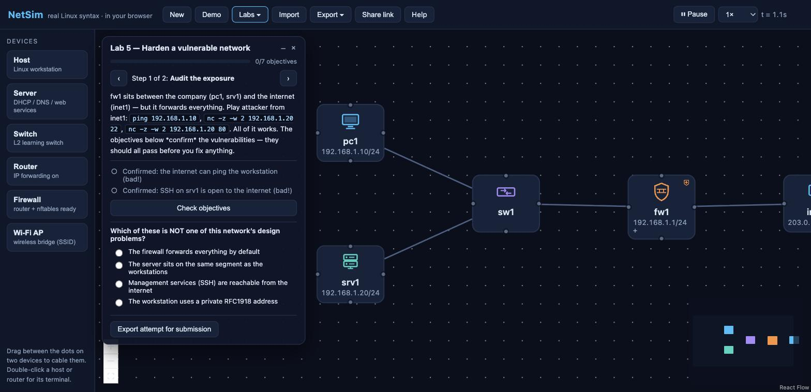

# NetSim

**A network simulator that runs entirely in your browser — real Linux syntax, drag-and-drop
topologies, zero install, no backend.**

### ▶ Try it live: <https://netsim.borck.education/>

Build networks from hosts, switches and routers on a canvas; open a terminal on any device and
configure it with genuine `iproute2` commands (`ip addr`, `ip route`, `ping`, `traceroute`);
watch ARP and ICMP packets animate across the wire. Built as a teaching tool first, with network
design and firewall-config testing as first-class goals.



## Documentation

- **[User guide](docs/USER_GUIDE.md)** — the interface, workflow, and what is and isn't simulated
- **[Labs & examples catalogue](docs/LABS.md)** — the five bundled labs and two example networks
- **[Lab authoring guide](docs/LAB_AUTHORING.md)** — write and grade your own labs (for educators)
- **[Design document](docs/DESIGN.md)** · **[Architecture decisions](docs/adr/)** · **[Contributing](CONTRIBUTING.md)**

## Inspiration

NetSim is a modern, open successor to the **iNetwork Simulator**, a GUI-based teaching tool
built at the University of Technology Sydney in the early 2000s (C#/.NET, Windows-only). Its
firewall component is described in:

> M. Ye and K. Sandrasegaran, *"Teaching about Firewall Concepts using the iNetwork Simulator"*,
> IEEE, 2006.

iNetwork let students drag workstations, switches, routers and servers onto a canvas, configure
them through dialogs, and test connectivity from a simulated DOS prompt — with guided lab
activities from IP addressing through DHCP, DNS, routing and firewalls. It was the right idea;
NetSim reimagines it with today's constraints removed: it runs on anything with a browser, uses
**real Linux command syntax instead of an invented CLI**, and is open source.

## The space this fills

Surveying the field (Packet Tracer / PT Anywhere, Boson NetSim, GNS3, EVE-NG, Containerlab,
Kathará, Filius, NetPilot), every existing tool fails at least one of these:

| Requirement | Who fails it |
|---|---|
| Fully client-side — static hosting, works on locked-down lab machines and Chromebooks | PT Anywhere, Boson, NetPilot (server-side); GNS3/EVE-NG/Containerlab (need a server or Docker); Filius (Java desktop) |
| Real open-source Linux syntax (`iproute2`, and later nftables/iptables) | Packet Tracer & Boson (Cisco IOS); Filius & iNetwork (invented CLIs) |
| Drag-and-drop multi-device topology building | single-host firewall practice tools |
| Free and open source | Packet Tracer, Boson, NetPilot |

To our knowledge **no browser-based tool teaches nftables at all** — that gap is a core target
of phase 2.

## Design principles

1. **Simulate Linux; never fake it.** The engine is a pure-TypeScript discrete-event simulator.
   Commands accept a curated subset of *real* syntax and **error loudly on anything
   unsupported** — students never learn syntax that won't work on a real machine.
2. **Every packet is explainable.** Deterministic simulation means the tool can always say
   *why* a packet was dropped or where it went — the pedagogical advantage a real kernel (or a
   WASM VM) cannot offer.
3. **No backend, ever (for the core).** Topologies autosave to localStorage, export/import as
   JSON files, and share as compressed URLs. A lecturer posts a file or link; students load it
   and export their attempt for submission.

See [docs/DESIGN.md](docs/DESIGN.md) for the full design document and
[docs/adr/](docs/adr/) for the architecture decision records behind these choices.

## Status — all six roadmap phases complete

Working now:

- Drag-and-drop topology editor (hosts, L2 learning switches, routers, firewalls) with cable
  connections
- Per-device xterm.js terminals: `ip address|link|route|neigh`, `ping`, `traceroute`, `arp`,
  `sysctl net.ipv4.ip_forward`, `hostname`, `help`
- Full ARP + IPv4 + ICMP simulation: longest-prefix routing, TTL/time-exceeded,
  destination-unreachable, MAC learning — with live packet animation, pause and speed control
- **Firewalls (phase 2):** `nft` and `iptables` front-ends compiling to one shared rule model —
  rules added in either dialect list in both (`nft list ruleset`, `iptables -S`); input/forward/
  output chains with accept/drop/reject and policies; connection tracking for
  `ct state new,established,related` (stateful firewalls); NAT — masquerade, SNAT, DNAT port
  forwarding; a per-device firewall log that names the exact rule behind every verdict; red
  drop-flash animation at the device that killed a packet
- **Sockets (phase 2):** minimal TCP handshake + UDP, `nc` port testing
  (open / refused / filtered), `nc -l` listeners, per-device "listening services" (lab
  targets), `ss` and `conntrack -L`
- **Services (phase 3):** DHCP — `dhclient` runs the real DISCOVER/OFFER/REQUEST/ACK exchange
  as broadcast packets against a configurable DHCP server (pool, gateway, DNS options, visible
  leases) and installs the address, default route and nameserver; DNS — an A-record server
  (hosts-file style records) queried over real udp/53 traffic by `dig [@server] [+short]`,
  with hostname resolution wired into `ping`, `traceroute`, `nc` and `curl`; HTTP — a
  configurable web server fetched with `curl [-v]` over the simulated TCP handshake, with
  genuine curl error codes for refused/filtered/unresolvable. All service traffic is ordinary
  packets: it animates on the wire (per-protocol colours) and can be firewalled — blocking
  udp/67 kills DHCP, udp/53 kills DNS, tcp/80 kills the web. New Server device type; the demo
  ships the full journey: `dhclient` on pc2, then `curl http://web.lan/`.
- Inspector panel: interface state/addresses, DNS client setting, DHCP/DNS/web service
  editors, live routing/ARP/MAC/conntrack tables, nftables ruleset view with copy-as-config,
  firewall log
- **Guided labs (phase 4):** a lab file format (starting topology + steps + objectives +
  quizzes) with an auto-grader that probes the live simulation using *real packets* — students
  watch the grader's pings, TCP connects, DNS queries and HTTP fetches animate while being
  marked. Lab player panel with step navigation, per-objective pass/fail with explanations,
  progress bar, instant-feedback quizzes, and one-click **attempt export** for LMS submission
  (attempts re-import with full progress). Four bundled labs follow the classic iNetwork
  sequence: static addressing & ARP → routing → stateful firewalls → DHCP/DNS/web. Lecturers
  author labs as JSON and distribute them as files or share-links.
- **Exports (phase 5)** — the design-tool half of the vision. From the Export menu:
  **device config bundle (.zip)** with genuine per-device `setup.sh` (iproute2 + sysctl),
  `nftables.conf` and `dnsmasq.conf` — *validated in CI against the real `nft` and `dnsmasq`
  binaries*, so what the browser generates, Linux accepts; **containerlab topology**
  (`.clab.yml`, linux nodes + bridged switches + nft rules as exec lines) to deploy the design
  with real kernels; **docker-compose** (approximate L2, documented); **SVG/PNG topology
  diagrams** (documentation-grade, light theme); and a **printable HTML network report**
  (inline diagram, device inventory, cabling, routing tables, DHCP/DNS config, firewall
  rulesets).
- **Dynamic routing, VLANs & wireless (phase 6):** RIP on routers/firewalls — periodic udp/520
  broadcast advertisements with split horizon, hop-count metrics, route timeout and visible
  convergence; learned routes appear in `ip route` as `proto rip` and firewalls can block the
  protocol (drop udp/520) like anything else. Access-port **VLANs** on switches: per-port VLAN
  assignment isolates broadcast domains (same-subnet hosts in different VLANs can't even ARP),
  with a per-VLAN MAC table. **Wireless APs**: SSID-labelled bridge devices whose client links
  render as dashed wireless associations.
- Autosave, JSON export/import (including firewall rules, service configs, lab progress, RIP,
  VLANs and SSIDs), shareable topology URLs, demo topology

Future work beyond the original roadmap: OSPF, 802.1Q trunks, IPv6, a v86 real-VM node type
(ADR 0002), and more bundled labs — contributions welcome.

## Development

```sh
npm install     # note: .npmrc sets bin-links=false (repo may live on ExFAT)
npm run dev     # dev server
npm test        # engine + command tests (vitest)
npm run build   # type-check + production bundle
```

Stack: TypeScript, React, [React Flow](https://reactflow.dev), [xterm.js](https://xtermjs.org),
Zustand, Vite, Vitest. The engine (`src/engine/`) and command layer (`src/commands/`) are
framework-free and fully unit-tested.

## License

[MIT](LICENSE) — © 2026 Michael Borck.
